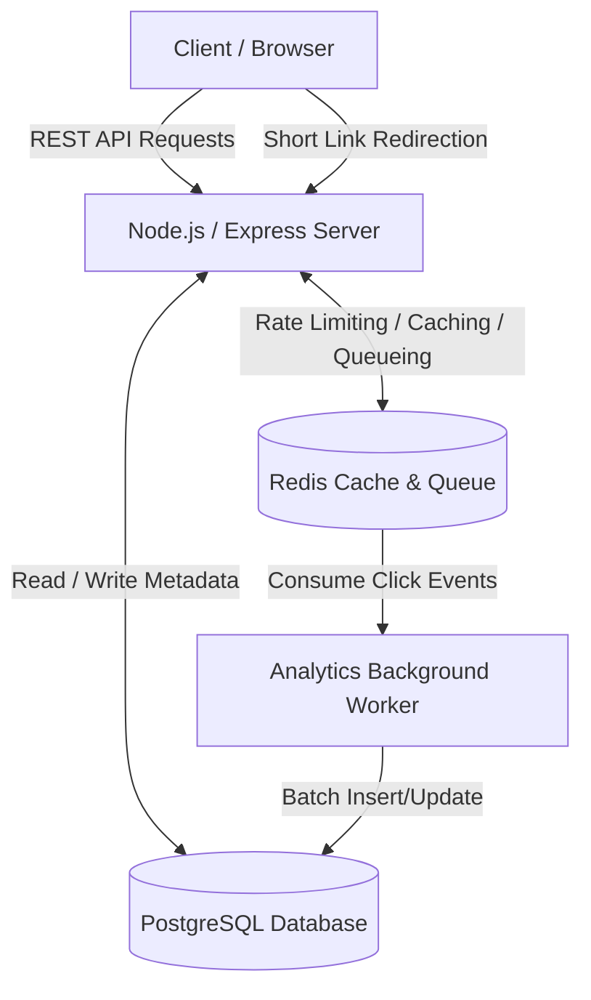

# URL Shortener

A scalable, high-performance URL shortening service that allows users to create short links, custom aliases, manage their links, and track comprehensive analytics.

## Features
- **User Authentication**: Secure signup and login functionality.
- **Link Management**: Create, view, update, and delete shortened URLs.
- **Custom Aliases**: Premium users can set custom, branded short codes.
- **Analytics Tracking**: Asynchronous tracking of clicks, referrers, and device information.
- **QR Codes**: Automatic generation of QR codes for shortened URLs.

## High-Level Design (HLD)

The application follows a standard modular architecture separated into distinct services to handle high traffic and background processing efficiently.

### Component Breakdown
1. **API Server (Node.js/Express)**: Serves as the primary entry point. It manages routing, middleware (such as rate-limiting and authentication), and business logic for URL creation, user management, and redirects.
2. **Database (PostgreSQL with Knex.js)**: A relational database storing persistent data securely. Key tables include `users`, `urls`, and `analytics`.
3. **Redis**: Used as an in-memory datastore for fast operations like rate limiting, caching frequently accessed URLs (for ultra-fast redirection), and acting as a message broker for analytics.
4. **Analytics Worker**: To prevent the main thread from blocking during redirection, analytics (e.g., recording a click) are pushed to a Redis queue and processed asynchronously by background workers that batch-update the database.

## Technologies Used
- Backend: **Node.js, Express.js**
- Database: **PostgreSQL, Knex.js (Query Builder)**
- Caching & Queues: **Redis**
- Frontend: **HTML, CSS, Vanilla JS**
- Auth/Security: **JWT, bcrypt**
